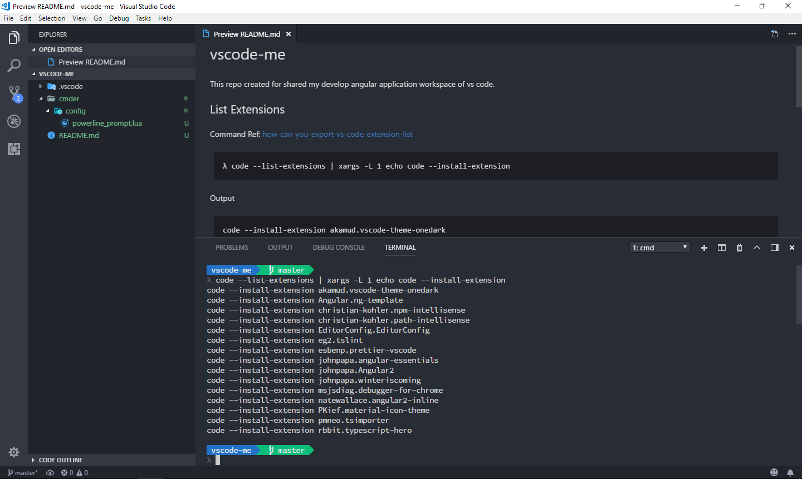

# vscode-me

This repo created for shared my develop angular application workspace of vs code. 

Preview:  


## List Extensions

Command Ref: [how-can-you-export-vs-code-extension-list](https://stackoverflow.com/questions/35773299/how-can-you-export-vs-code-extension-list)

```
λ code --list-extensions | xargs -L 1 echo code --install-extension
```

Output

```
code --install-extension akamud.vscode-theme-onedark
code --install-extension Angular.ng-template
code --install-extension christian-kohler.npm-intellisense
code --install-extension christian-kohler.path-intellisense
code --install-extension EditorConfig.EditorConfig
code --install-extension eg2.tslint
code --install-extension esbenp.prettier-vscode
code --install-extension johnpapa.angular-essentials
code --install-extension johnpapa.Angular2
code --install-extension johnpapa.winteriscoming
code --install-extension msjsdiag.debugger-for-chrome
code --install-extension natewallace.angular2-inline
code --install-extension PKief.material-icon-theme
code --install-extension pmneo.tsimporter
code --install-extension rbbit.typescript-hero
```

## Cmder Powerline

* Download Font [Source Code Pro for Powerline](https://github.com/powerline/fonts/tree/master/SourceCodePro)

* Custom Terminal Style [Cmder-powerline-prompt](https://github.com/AmrEldib/cmder-powerline-prompt)
